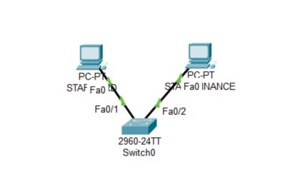

# 📚 **MODUL PRAKTIKUM DMJK - PEKAN 1**
**Dasar Jaringan Komputer & Pengenalan Packet Tracer**

---

# 📚 Deskripsi Singkat

Pada pertemuan pertama ini, mahasiswa Sistem Informasi akan diperkenalkan pada **konsep fundamental jaringan komputer** dan bagaimana jaringan mendukung **sistem informasi dalam organisasi**. Pembahasan mencakup:

- **Peran jaringan dalam SI**: Bagaimana jaringan mendukung flow data dalam sistem ERP, CRM, dan database
- **Komponen dasar jaringan**: PC, switch, router, dan media transmisi
- **Konektivitas sederhana**: Komunikasi antar komputer dalam satu kantor
- **Tools documentation**: Membuat diagram jaringan professional

💻 *Praktikum*: Pengenalan **Cisco Packet Tracer** sebagai simulator utama dan **Draw.io** untuk dokumentasi, dilanjutkan dengan membangun koneksi sederhana antara 2 PC dan mendokumentasikan hasilnya secara professional.

---

## 🎯 Tujuan Pembelajaran

✅ Mahasiswa mampu menjelaskan peran jaringan komputer dalam mendukung sistem informasi organisasi.  
✅ Mahasiswa dapat mengidentifikasi komponen dasar jaringan (PC, switch, kabel) dan fungsinya.  
✅ Mahasiswa menguasai penggunaan **Cisco Packet Tracer** untuk simulasi jaringan sederhana.  
✅ Mahasiswa dapat membuat dokumentasi jaringan professional menggunakan **Draw.io**.  
✅ Mahasiswa memahami konsep dasar komunikasi data antar komputer dalam LAN.

---

## 👥 Pembagian Tugas Tim

👨‍💻 **Network Administrator**:
- Melakukan instalasi dan setup **Cisco Packet Tracer**
- Membangun topologi sederhana (2 PC + 1 Switch) dan testing konektivitas

👩‍💻 **Documentation Specialist**:
- Membuat diagram jaringan professional menggunakan **Draw.io**
- Mendokumentasikan konfigurasi dan hasil testing dalam format laporan

👉 *Jika bekerja individual*, setiap mahasiswa menjalankan kedua peran secara bergantian.

---

## 🛠️ Langkah-Langkah Praktikum

### a. 🚀 Persiapan Tools

#### 1. Instalasi Cisco Packet Tracer
1. **Download** Cisco Packet Tracer dari [Cisco Networking Academy](https://www.netacad.com/cisco-packet-tracer)
2. **Register** akun Cisco NetAcad (gratis untuk pendidikan):
   - Kunjungi netacad.com
   - Pilih "Sign Up" → "I'm a Student"
   - Isi data dengan email edu atau email pribadi
   - Verifikasi email dan complete profile
3. **Install** Packet Tracer:
   - Download versi sesuai OS (Windows/macOS/Linux)
   - Install dengan Next → Next → Install → Finish
   - Login dengan akun NetAcad yang sudah dibuat

#### 2. Akses Draw.io untuk Dokumentasi
1. **Buka browser** dan kunjungi [app.diagrams.net](https://app.diagrams.net)
2. **Pilih storage**: "Decide later" untuk tidak save online, atau pilih Google Drive/OneDrive
3. **Familiarisasi interface**: Left panel (shapes), Canvas (area kerja), Right panel (properties)

### b. 🖥️ Pengenalan Interface Packet Tracer

#### 1. Orientasi Workspace
1. **Buka Packet Tracer** dan login dengan akun NetAcad
2. **Create New** → Pilih "Blank" activity
3. **Kenali interface utama**:
   - **Logical Workspace**: Area utama untuk membangun topologi
   - **Physical Workspace**: Tab untuk melihat perangkat secara fisik
   - **Device Categories**: Panel bawah dengan kategori perangkat
   - **Device Models**: Panel dengan model spesifik setiap kategori

#### 2. Exploring Device Categories
1. **End Devices**: Komputer, laptop, server, printer
2. **Network Devices**: Hub, switch, router, wireless devices
3. **Connections**: Berbagai jenis kabel dan wireless connections
4. **Miscellaneous**: IoT devices, smart home devices

### c. 🖧 Membangun Topologi Sederhana

#### Scenario: Jaringan Kantor Sederhana
*"Menghubungkan 2 komputer karyawan melalui 1 switch untuk sharing file dan printer"*

#### 1. Menempatkan Perangkat
1. **Pilih End Devices** → **PC-PT** 
2. **Drag 2 PC** ke workspace:
   - PC0 (untuk User 1 - Staff HRD)
   - PC1 (untuk User 2 - Staff Finance)
3. **Pilih Network Devices** → **Switch** → **2960**
4. **Drag 1 Switch** ke tengah antara kedua PC

#### 2. Koneksi Perangkat
1. **Pilih Connections** → **Copper Straight-Through** (ikon kabel hijau)
2. **Hubungkan PC0**:
   - Klik PC0 → pilih **FastEthernet0**
   - Klik Switch → pilih **FastEthernet0/1**
   - Tunggu hingga kedua ujung kabel berubah hijau
3. **Hubungkan PC1**:
   - Klik PC1 → pilih **FastEthernet0**
   - Klik Switch → pilih **FastEthernet0/2**
   - Tunggu hingga koneksi established (lampu hijau)

### d. 🔧 Konfigurasi Basic Network

#### 1. Konfigurasi IP Address PC0
1. **Klik PC0** → Tab **Desktop** → **IP Configuration**
2. **Set IP Address**:
   - IP Address: `192.168.1.10`
   - Subnet Mask: `255.255.255.0`
   - Default Gateway: (kosongkan dulu)
3. **Close window** IP Configuration

#### 2. Konfigurasi IP Address PC1  
1. **Klik PC1** → Tab **Desktop** → **IP Configuration**
2. **Set IP Address**:
   - IP Address: `192.168.1.20`
   - Subnet Mask: `255.255.255.0`
   - Default Gateway: (kosongkan dulu)
3. **Close window** IP Configuration

### e. 📡 Testing Konektivitas

#### 1. Ping Test dari PC0
1. **Klik PC0** → Tab **Desktop** → **Command Prompt**
2. **Ketik command**: `ping 192.168.1.20`
3. **Observe result**:
   - **Success**: `Reply from 192.168.1.20: bytes=32 time<1ms TTL=128`
   - **Failed**: `Request timed out` (cek konfigurasi IP dan kabel)

#### 2. Ping Test dari PC1
1. **Klik PC1** → Tab **Desktop** → **Command Prompt**
2. **Ketik command**: `ping 192.168.1.10`
3. **Verify bidirectional connectivity**

#### 3. Understanding the Process
1. **Switch Mode ke Simulation** (ikon jam di kanan bawah)
2. **Delete event filters** → **Edit Filters** → **IPv4** only
3. **Kirim ping lagi** dan **observe packet flow**:
   - PC0 mengirim ARP request untuk mencari MAC address PC1
   - Switch mempelajari MAC address kedua PC
   - ICMP packet diteruskan berdasarkan MAC address table

### f. 📖 Dokumentasi dengan Draw.io

#### 1. Membuat Network Diagram
1. **Buka Draw.io** di browser
2. **Pilih template**: "Network" atau "Basic" 
3. **Drag components**:
   - 2 Computer icons untuk PC0 dan PC1
   - 1 Switch icon
   - Lines untuk koneksi
4. **Labeling**:
   - PC0: "HRD Staff (192.168.1.10)"
   - PC1: "Finance Staff (192.168.1.20)"
   - Switch: "Office Switch 2960"

#### 2. Professional Formatting
1. **Add title**: "Jaringan Kantor Sederhana - Lab Week 1"
2. **Add legend**: Jelaskan simbol yang digunakan
3. **Color coding**: Gunakan warna konsisten untuk setiap jenis device
4. **Export**: File → Export as → PNG atau PDF

---

## 📝 Kriteria Penilaian

- **✅ Penguasaan Tools (25%)**:
  - Berhasil menginstal dan mengoperasikan Packet Tracer tanpa error
  - Dapat menggunakan Draw.io untuk membuat diagram professional
  
- **✅ Implementasi Jaringan (40%)**:
  - Topologi 2 PC + 1 Switch terhubung dengan benar
  - IP address dikonfigurasi sesuai requirement
  - Ping test berhasil bidirectional
  
- **✅ Dokumentasi & Pemahaman (35%)**:
  - Diagram jaringan professional dan informatif
  - Mampu menjelaskan fungsi setiap komponen
  - Memahami konsep komunikasi data dalam konteks SI

---

## ✔️ Checklist Praktikum

1. **Cisco Packet Tracer** terinstal dan dapat dijalankan dengan lancar
2. **Draw.io** dapat diakses dan digunakan untuk membuat diagram
3. Topologi 2 PC + 1 Switch berhasil dibuat di Packet Tracer
4. IP Address pada PC0 (`192.168.1.10`) dan PC1 (`192.168.1.20`) terkonfigurasi
5. **Ping test** antara kedua PC berhasil (bidirectional)
6. **Network diagram** professional dibuat menggunakan Draw.io
7. Mahasiswa dapat menjelaskan alur komunikasi data antar PC

---

## 🔍 Latihan Mandiri

1. **Ekspansi Jaringan**: Tambahkan PC ketiga dengan IP `192.168.1.30`, pastikan semua PC dapat saling ping.

2. **Physical View**: Explore tab "Physical" di Packet Tracer untuk melihat perangkat secara fisik, coba nyalakan/matikan PC.

3. **Simulation Mode**: Gunakan Simulation Mode untuk mengobservasi detail packet flow saat ping, perhatikan protokol ARP dan ICMP.

4. **Alternative Diagram**: Buat variasi diagram yang sama menggunakan template berbeda di Draw.io, bandingkan hasilnya.

---

## 📅 Deadline & Pengumpulan

- **⏰ Deadline**: Akhir Pekan 1 (sebelum pertemuan Week 2)
- **📍 Platform**: Submit melalui sistem LMS atau email dosen
- **📝 Deliverables**:
  1. **File Packet Tracer** (.pkt): Topologi yang sudah dikonfigurasi dan berfungsi
  2. **Network Diagram** (.png/.pdf): Diagram professional dari Draw.io  
  3. **Laporan Singkat** (.pdf): Berisi:
     - Screenshot konfigurasi IP pada PC0 dan PC1
     - Screenshot hasil ping test (bidirectional)
     - Penjelasan singkat tentang fungsi setiap komponen
     - Refleksi: Bagaimana jaringan ini dapat mendukung operasi kantor sehari-hari

---

## 📸 Contoh Screenshot Praktikum

### 1. **Topologi Jaringan di Packet Tracer**

- Tampilan workspace dengan 2 PC dan 1 switch terhubung
- Status lampu hijau pada semua koneksi
- Label yang jelas pada setiap device

### 2. **IP Configuration pada PC**
- Window IP Configuration menunjukkan IP address yang benar
- Subnet mask dan interface status

### 3. **Ping Test Results**
- Command Prompt menampilkan successful ping results
- Statistik: 4 packets sent, 4 received, 0% packet loss

### 4. **Professional Network Diagram**
- Diagram Draw.io dengan simbol yang tepat
- Label IP address dan device names
- Clean layout dengan proper spacing

---

## 🛠️ Troubleshooting Tips

- **Ping "Request timed out"**:
  - Periksa kembali IP address dan subnet mask pada kedua PC
  - Pastikan kabel terhubung dengan benar (lampu hijau)
  - Verify interface status: Desktop → IP Configuration

- **Packet Tracer tidak bisa login**:
  - Pastikan internet connection stable
  - Clear browser cache jika menggunakan web version
  - Coba restart aplikasi

- **Draw.io tidak menyimpan**:
  - Pilih storage location (Google Drive/OneDrive) di awal
  - Atau download file secara manual: File → Download

- **Device tidak connect**:
  - Gunakan Copper Straight-Through cable untuk PC-to-Switch
  - Pastikan memilih port yang benar (FastEthernet0 untuk PC)

---

## ✨ Inspirasi Hari Ini

> "**Setiap sistem informasi yang powerful dimulai dari pemahaman jaringan yang solid. Hari ini kita meletakkan fondasi untuk membangun infrastruktur digital masa depan.**"

---

**💡 Reflection Questions:**
1. Bagaimana jaringan sederhana ini dapat mendukung sharing data antara departemen HRD dan Finance?
2. Apa yang terjadi jika switch mengalami kerusakan? Bagaimana backup plannya?
3. Dari perspektif Sistem Informasi, komponen apa saja yang masih diperlukan untuk membuat jaringan ini production-ready?

**🚀 Next Week Preview:** Minggu depan kita akan belajar tentang IP addressing yang lebih advanced dan bagaimana merencanakan alamat IP untuk organisasi dengan multiple departemen!
