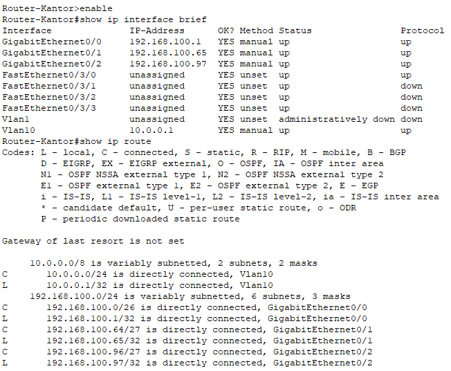
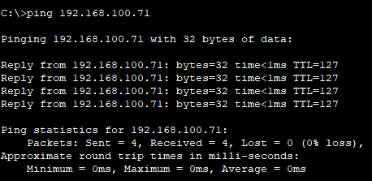

# 📚 **MODUL PRAKTIKUM DMJK - PEKAN 2**
**Pengalamatan IP & Pembagian Subnet Manual untuk Sistem Informasi**

---

# 📚 Deskripsi Singkat

Pada pertemuan kedua ini, mahasiswa akan mempelajari **perencanaan alamat IP untuk organisasi** dengan pendekatan perhitungan manual. Fokus pembelajaran adalah bagaimana **sistem informasi multi-departemen memerlukan pembagian jaringan** yang terstruktur. Pembahasan meliputi:

- **Perencanaan IP untuk organisasi**: Pembagian alamat IP berdasarkan struktur departemen
- **Pembagian subnet manual**: Perhitungan subnet tanpa alat bantu otomatis untuk pemahaman konsep
- **Segmentasi departemen**: Bagaimana membagi jaringan sesuai kebutuhan bisnis
- **Standar dokumentasi**: Pencatatan alokasi IP yang sistematis

💻 *Praktikum*: Mahasiswa akan melakukan **perhitungan manual** untuk membagi jaringan `/24` menjadi 3 subnet departemen (HRD, Keuangan, IT), mengimplementasikannya di **Packet Tracer**, dan mendokumentasikan **tabel alokasi IP** menggunakan **Draw.io**.

---

## 🎯 Tujuan Pembelajaran

✅ Mahasiswa mampu melakukan **perhitungan manual** untuk pembagian subnet `/24` menjadi beberapa subnet.  
✅ Mahasiswa dapat merencanakan **alokasi IP** berdasarkan struktur organisasi dan kebutuhan departemen.  
✅ Mahasiswa menguasai implementasi **skema pengalamatan IP** di Packet Tracer untuk skenario multi-departemen.  
✅ Mahasiswa dapat membuat **tabel dokumentasi IP** yang profesional untuk keperluan administrasi jaringan.  
✅ Mahasiswa memahami hubungan antara **segmentasi jaringan** dan **keamanan sistem informasi**.

---

## 👥 Pembagian Tugas Tim

👨‍💻 **Perencana Jaringan**:
- Melakukan perhitungan manual untuk perencanaan subnet
- Membuat skema alokasi IP untuk 3 departemen
- Memverifikasi tidak ada tumpang tindih IP antar departemen

👩‍💻 **Spesialis Implementasi**:
- Mengimplementasikan skema IP di Packet Tracer
- Menguji konektivitas antar departemen
- Membuat tabel dokumentasi di Draw.io

👉 *Jika bekerja individual*, setiap mahasiswa menjalankan kedua peran secara bergantian.

---

## 🛠️ Langkah-Langkah Praktikum

### a. 📊 Perencanaan & Perhitungan Manual

#### Skenario: Kantor PT. Digital Maju
**Kebutuhan Organisasi:**
- **Departemen HRD**: 25 komputer (basis data karyawan, sistem penggajian)
- **Departemen Keuangan**: 15 komputer (perangkat lunak akuntansi, sistem ERP)  
- **Departemen IT**: 10 komputer (manajemen server, sistem help desk)
- **Penyangga pertumbuhan**: Masing-masing departemen perlu ruang untuk ekspansi 50%

#### 1. Analisis Kebutuhan Host
```
Departemen     | Saat Ini | Penyangga | Total Dibutuhkan | Ukuran Subnet
HRD            | 25       | 13        | 38 host          | /26 (62 host)
Keuangan       | 15       | 8         | 23 host          | /27 (30 host)  
IT             | 10       | 5         | 15 host          | /27 (30 host)
```

#### 2. Perhitungan Subnet Manual
**Jaringan Dasar**: `192.168.100.0/24`

**Subnet 1 - Departemen HRD (/26):**
- Alamat Jaringan: `192.168.100.0/26`
- Subnet Mask: `255.255.255.192`
- Rentang Host: `192.168.100.1` - `192.168.100.62`
- Broadcast: `192.168.100.63`
- Gateway: `192.168.100.1`

**Subnet 2 - Departemen Keuangan (/27):**
- Alamat Jaringan: `192.168.100.64/27`  
- Subnet Mask: `255.255.255.224`
- Rentang Host: `192.168.100.65` - `192.168.100.94`
- Broadcast: `192.168.100.95`
- Gateway: `192.168.100.65`

**Subnet 3 - Departemen IT (/27):**
- Alamat Jaringan: `192.168.100.96/27`
- Subnet Mask: `255.255.255.224`
- Rentang Host: `192.168.100.97` - `192.168.100.126`
- Broadcast: `192.168.100.127`
- Gateway: `192.168.100.97`

#### 3. Daftar Periksa Verifikasi
- ✅ Tidak ada tumpang tindih IP antar subnet
- ✅ Host cukup untuk setiap departemen + penyangga
- ✅ Alokasi IP logis (blok departemen berurutan)
- ✅ Ruang tersisa untuk ekspansi masa depan (`192.168.100.128/25`)

### b. 🖧 Implementasi di Packet Tracer

#### 1. Membangun Topologi Fisik
1. **Buat Perangkat**:
   - 1 Router 2911 (untuk routing antar-departemen)
   - 3 Switch 2960 (satu per departemen)
   - 6 PC (2 PC per departemen sebagai sampel)
   - 1 Server (untuk layanan bersama)

2. **Penempatan Perangkat**:
   ```
   Area HRD:      Switch1 + PC-HRD1 + PC-HRD2
   Area Keuangan: Switch2 + PC-KEU1 + PC-KEU2  
   Area IT:       Switch3 + PC-IT1 + PC-IT2
   Ruang Server:  Server0 (terhubung ke Router)
   ```

#### 2. Koneksi Fisik
1. **Router ke Switch**:
   - Router GigabitEthernet0/0 → Switch1 Fa0/1 (HRD)
   - Router GigabitEthernet0/1 → Switch2 Fa0/1 (Keuangan)
   - Router GigabitEthernet0/2 → Switch3 Fa0/1 (IT)

2. **PC ke Switch**:
   - PC-HRD1/2 → Switch1 Fa0/2-3
   - PC-KEU1/2 → Switch2 Fa0/2-3
   - PC-IT1/2 → Switch3 Fa0/2-3

3. **Koneksi Server**:
   - Server0 → Router Fa0/0/0 (atau port yang tersedia)

### c. 🔧 Konfigurasi IP

#### 1. Konfigurasi Interface Router
```cisco
Router> enable
Router# configure terminal
Router(config)# hostname Router-Kantor

! Interface Departemen HRD
Router(config)# interface gigabitEthernet0/0
Router(config-if)# ip address 192.168.100.1 255.255.255.192
Router(config-if)# description Gateway Departemen HRD
Router(config-if)# no shutdown

! Interface Departemen Keuangan
Router(config-if)# interface gigabitEthernet0/1
Router(config-if)# ip address 192.168.100.65 255.255.255.224
Router(config-if)# description Gateway Departemen Keuangan
Router(config-if)# no shutdown

! Interface Departemen IT
Router(config-if)# interface gigabitEthernet0/2
Router(config-if)# ip address 192.168.100.97 255.255.255.224
Router(config-if)# description Gateway Departemen IT
Router(config-if)# no shutdown

Router(config-if)# exit
Router(config)# exit
Router# write memory
```

#### 2. Konfigurasi PC per Departemen

**PC Departemen HRD:**
- PC-HRD1: `192.168.100.10/26`, Gateway: `192.168.100.1`
- PC-HRD2: `192.168.100.11/26`, Gateway: `192.168.100.1`

**PC Departemen Keuangan:**
- PC-KEU1: `192.168.100.70/27`, Gateway: `192.168.100.65`
- PC-KEU2: `192.168.100.71/27`, Gateway: `192.168.100.65`

**PC Departemen IT:**
- PC-IT1: `192.168.100.100/27`, Gateway: `192.168.100.97`
- PC-IT2: `192.168.100.101/27`, Gateway: `192.168.100.97`

**Server Bersama:**
- Server0: `10.0.0.10`, Gateway: `10.0.0.1`

### d. 📡 Pengujian Konektivitas

#### 1. Pengujian Dalam Departemen
```bash
# Dari PC-HRD1
ping 192.168.100.11    # ke PC-HRD2 (subnet sama)
ping 192.168.100.1     # ke Gateway HRD

# Dari PC-KEU1  
ping 192.168.100.71    # ke PC-KEU2 (subnet sama)
ping 192.168.100.65    # ke Gateway Keuangan

# Dari PC-IT1
ping 192.168.100.101   # ke PC-IT2 (subnet sama)  
ping 192.168.100.97    # ke Gateway IT
```

#### 2. Pengujian Antar Departemen
```bash
# Konektivitas lintas departemen
ping 192.168.100.10    # HRD1 dari Keuangan
ping 192.168.100.70    # Keuangan1 dari IT
ping 192.168.100.100   # IT1 dari HRD

# Akses ke server
ping 10.0.0.10   # Server dari semua departemen
```

#### 3. Verifikasi Routing
```cisco
# Pada Router
show ip route
show ip interface brief
show running-config
```

### e. 📖 Dokumentasi Profesional

#### 1. Tabel Alokasi IP (Draw.io)
Buat tabel profesional dengan kolom:
- **Departemen**
- **Subnet** 
- **Alamat Jaringan**
- **Subnet Mask**
- **IP Gateway**
- **Rentang Host**
- **Alamat Broadcast**
- **Host Tersedia**
- **Perangkat Terpasang**

#### 2. Diagram Topologi Jaringan
1. **Diagram Logis**:
   - Tampilkan router dengan 3 cabang subnet
   - Beri label semua alamat IP dan subnet mask
   - Sertakan nama departemen dan jumlah perangkat

2. **Peta Alamat IP**:
   - Representasi visual dari penggunaan ruang IP
   - Kode warna per departemen
   - Area ekspansi masa depan diberi highlight

#### 3. Standar Dokumentasi
- **Judul**: "Rencana Alamat IP - PT Digital Maju"
- **Tanggal & Versi**: Tanggal saat ini, Versi 1.0
- **Legenda**: Jelaskan simbol dan kode warna
- **Catatan**: Sertakan metodologi perhitungan dan asumsi

---

## 📝 Kriteria Penilaian

- **✅ Akurasi Perhitungan Manual (30%)**:
  - Perhitungan subnet yang benar untuk ketiga departemen
  - Tidak ada tumpang tindih IP dan ukuran subnet tepat
  - Alamat jaringan/broadcast yang valid

- **✅ Implementasi & Pengujian (40%)**:
  - Interface router dikonfigurasi dengan benar
  - Penetapan IP PC sesuai perencanaan
  - Konektivitas dalam dan antar departemen berhasil

- **✅ Kualitas Dokumentasi (30%)**:
  - Tabel alokasi IP yang profesional
  - Diagram topologi jaringan yang jelas  
  - Standar dokumentasi yang komprehensif

---

## ✔️ Daftar Periksa Praktikum

1. **Perhitungan manual** untuk 3 subnet selesai dengan benar
2. **Interface router** dikonfigurasi dengan alamat IP yang tepat  
3. **Konfigurasi PC** sesuai dengan penetapan IP departemen
4. **Ping dalam departemen** berhasil dalam setiap subnet
5. **Ping antar departemen** berhasil melalui router
6. **Akses ke server** dari semua departemen
7. **Tabel alokasi IP** dibuat secara profesional di Draw.io
8. **Diagram topologi jaringan** jelas dan informatif

---

## 🔍 Latihan Mandiri

1. **Latihan VLSM**: Coba buat perencanaan subnet dengan kebutuhan berbeda (50, 20, 10 host) menggunakan VLSM.

2. **Perencanaan Skalabilitas**: Rancang rencana ekspansi jika setiap departemen berkembang 100% dalam 2 tahun.

3. **Skema Alternatif**: Bandingkan dengan kelas B (`172.16.0.0/16`) atau kelas A privat (`10.0.0.0/8`).

4. **Pertimbangan Keamanan**: Identifikasi departemen mana yang sebaiknya TIDAK memiliki akses langsung satu sama lain.

---

## 📅 Batas Waktu & Pengumpulan

- **⏰ Batas Waktu**: Akhir Pekan 2
- **📍 Platform**: Kirim melalui LMS/email dosen
- **📝 Berkas yang Dikumpulkan**:
  1. **File Packet Tracer** (.pkt): Topologi lengkap dengan konfigurasi IP
  2. **Tabel Alokasi IP** (.png/.pdf): Dokumentasi profesional dari Draw.io
  3. **Diagram Jaringan** (.png/.pdf): Diagram topologi dengan label IP  
  4. **Lembar Kerja Perhitungan** (.pdf): Langkah perhitungan manual dan verifikasi
  5. **Laporan Pengujian** (.pdf): Tangkapan layar hasil ping dan verifikasi konektivitas

---

## 📸 Contoh Tangkapan Layar Praktikum

### 1. **Lembar Kerja Perhitungan Manual**
- Perhitungan tertulis tangan atau diketik yang menunjukkan pembagian subnet
- Perhitungan biner untuk subnet mask
- Alokasi rentang IP per departemen

### 2. **Konfigurasi Router**


- Output CLI yang menunjukkan konfigurasi IP interface
- Hasil perintah `show ip interface brief`
- Output `show ip route`

### 3. **Hasil Uji Ping yang Berhasil**


- Hasil ping antar departemen
- Akses ke server dari subnet berbeda
- Statistik waktu perjalanan pulang-pergi dan paket

### 4. **Dokumentasi IP Profesional**
- Tabel alokasi IP yang bersih dan terorganisir
- Topologi jaringan dengan label yang tepat
- Legenda dan standar dokumentasi

---

## 🛠️ Tips Pemecahan Masalah

- **Masalah Tumpang Tindih IP**:
  - Periksa kembali perhitungan manual
  - Verifikasi batas subnet tidak tumpang tindih
  - Gunakan konversi biner untuk verifikasi

- **Ping Gagal Antar Subnet**:
  - Periksa konfigurasi IP interface router
  - Verifikasi pengaturan gateway PC
  - Pastikan interface router sudah "no shutdown"

- **Kesalahan Konfigurasi Router**:
  - Gunakan `show running-config` untuk verifikasi pengaturan
  - Periksa status interface dengan `show ip interface brief`
  - Verifikasi tabel routing dengan `show ip route`

- **Format Dokumentasi**:
  - Jaga format yang konsisten di Draw.io
  - Gunakan font dan warna yang profesional
  - Pastikan semua informasi dapat dibaca dan akurat

---

## ✨ Inspirasi Hari Ini

> "**Pengalamatan IP yang terstruktur adalah fondasi dari keamanan jaringan dan tata kelola sistem informasi. Hari ini kita belajar merencanakan infrastruktur yang dapat diskalakan dan aman.**"

---

**💡 Pertanyaan Refleksi:**
1. Mengapa setiap departemen memerlukan subnet terpisah dari perspektif sistem informasi?
2. Bagaimana perencanaan IP ini mendukung kebijakan keamanan organisasi?
3. Apa dampak dari segmentasi jaringan terhadap akses basis data dan kinerja aplikasi?

**🚀 Pratinjau Minggu Depan:** Minggu depan kita akan mengimplementasikan VLAN untuk pemisahan logis dan menjelajahi bagaimana VLAN mendukung kontrol akses dalam sistem informasi organisasi!