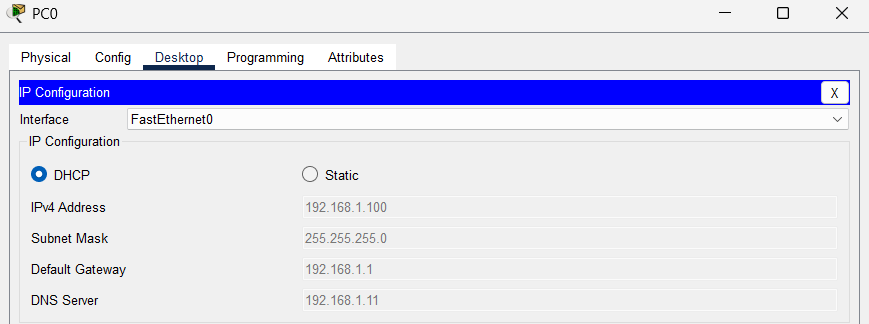
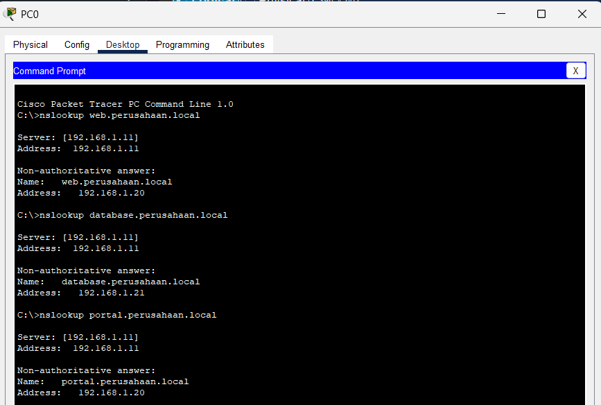
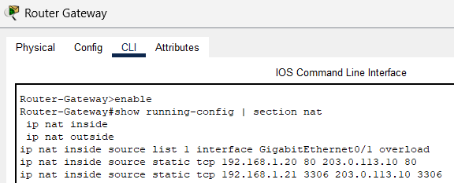
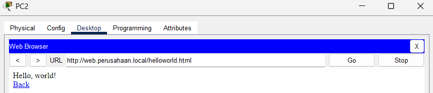

# 📚 **MODUL PRAKTIKUM DMJK - PEKAN 5**
**Layanan Jaringan untuk Sistem Informasi**

---

# 📚 Deskripsi Singkat

Pada pertemuan kelima ini, mahasiswa akan mempelajari **layanan jaringan penting** yang mendukung operasional **sistem informasi perusahaan**. Fokus pembelajaran adalah bagaimana **DHCP, DNS, dan NAT** menyediakan **konfigurasi otomatis**, **penemuan layanan**, dan **konektivitas internet** untuk aplikasi dan pengguna. Pembahasan meliputi:

- **Implementasi DHCP**: Alokasi IP otomatis untuk deployment skala besar
- **Layanan DNS**: Resolusi nama untuk server aplikasi dan layanan web
- **Konfigurasi NAT**: Konektivitas internet dengan konservasi alamat IP
- **Integrasi Layanan**: Bagaimana layanan jaringan mendukung aplikasi bisnis
- **Manajemen Terpusat**: Konfigurasi otomatis untuk administrasi jaringan yang disederhanakan

💻 *Praktikum*: Mahasiswa akan mengkonfigurasi **server DHCP** untuk penugasan IP otomatis, **server DNS** untuk resolusi nama internal, dan **NAT** untuk akses internet, kemudian mengintegrasikan semua layanan untuk mendukung **skenario aplikasi bisnis**.

---

## 🎯 Tujuan Pembelajaran

✅ Mahasiswa mampu mengkonfigurasi **server DHCP** untuk penugasan alamat IP otomatis dalam jaringan perusahaan.  
✅ Mahasiswa dapat mengimplementasikan **server DNS** untuk resolusi nama internal dan penemuan layanan.  
✅ Mahasiswa menguasai **konfigurasi NAT** untuk konektivitas internet dengan alamat IP privat.  
✅ Mahasiswa memahami **integrasi layanan** dan ketergantungan antar layanan jaringan.  
✅ Mahasiswa dapat merancang **arsitektur layanan** untuk mendukung aplikasi bisnis dan produktivitas pengguna.

---

## 👥 Pembagian Tugas Tim

👨‍💻 **Administrator Layanan Jaringan**:
- Konfigurasi server DHCP dan DNS
- Setup kebijakan alokasi IP otomatis
- Pengujian konfigurasi klien otomatis

👩‍💻 **Administrator Gateway Internet**:
- Konfigurasi NAT pada router untuk akses internet
- Setup port forwarding untuk server internal
- Pengujian konektivitas eksternal dan akses layanan

👉 *Jika bekerja individual*, setiap mahasiswa menjalankan kedua peran secara berurutan.

---

## 🛠️ Langkah-Langkah Praktikum

### a. 📋 Skenario Bisnis & Perencanaan Layanan

#### Skenario: Implementasi Layanan Jaringan PT. Digital Maju
**Kebutuhan Bisnis:**
- **Konfigurasi Otomatis**: 100+ karyawan memerlukan konfigurasi IP otomatis
- **Layanan Internal**: Server web, database, email harus dapat diakses via nama
- **Akses Internet**: Semua karyawan memerlukan akses internet untuk operasi bisnis
- **Penemuan Layanan**: Pengguna dapat mengakses aplikasi internal menggunakan nama yang mudah diingat
- **Manajemen Terpusat**: Tim IT dapat mengelola konfigurasi jaringan secara terpusat

#### 1. Perencanaan Arsitektur Layanan
```
Layanan          | Lokasi Server     | Tujuan
Server DHCP      | 192.168.1.10      | Alokasi IP otomatis untuk semua klien
Server DNS       | 192.168.1.11      | Resolusi nama untuk layanan internal  
Server Web       | 192.168.1.20      | Portal intranet perusahaan
Server Database  | 192.168.1.21      | Database bisnis pusat
Gateway NAT      | Interface Router  | Konektivitas internet untuk semua pengguna
```

#### 2. Rencana Alokasi Alamat IP
```
Segmen Jaringan    | Rentang IP           | Tujuan
Manajemen          | 192.168.1.1-9        | Infrastruktur jaringan
Server             | 192.168.1.10-50      | Server internal
Pool DHCP          | 192.168.1.100-200    | Alokasi klien dinamis
Cadangan           | 192.168.1.201-254    | Ekspansi masa depan
```

#### 3. Perencanaan Zone DNS
```
Domain Internal: perusahaan.local

Record A:
- dhcp.perusahaan.local     → 192.168.1.10
- dns.perusahaan.local      → 192.168.1.11  
- web.perusahaan.local      → 192.168.1.20
- database.perusahaan.local → 192.168.1.21
- portal.perusahaan.local   → 192.168.1.20 (alias)
```

### b. 🖧 Penyusunan Topologi Jaringan

#### 1. Topologi Fisik
```
Simulasi Internet
        |
    Router-Gateway
        |
    Switch-Core
     /    |    \
Server-DHCP  Server-DNS  Server-Web  Server-Database
     |         |           |            |
   [DHCP]    [DNS]       [WEB]        [DB]
                    |
              PC Klien (klien DHCP)
```

#### 2. Kebutuhan Perangkat
- **1 Router 2911** (Gateway dengan NAT)
- **1 Switch 2960** (Switch core)
- **4 Server** (DHCP, DNS, Web, Database)
- **3 PC** (klien DHCP untuk pengujian)
- **1 Router ISP** (simulasi Internet)

#### 3. Koneksi Fisik
- Router-Gateway Gi0/0 ↔ Switch-Core Fa0/1
- Router-Gateway Gi0/1 ↔ Router-ISP Gi0/0 (link Internet)
- Semua server ↔ Switch-Core (Fa0/2-5)
- Semua PC klien ↔ Switch-Core (Fa0/10-12)

### c. 🌐 Konfigurasi Server DHCP

#### 1. Setup Server DHCP (Perangkat Server)
**Konfigurasi IP Server DHCP:**
```
Alamat IP: 192.168.1.10
Subnet Mask: 255.255.255.0
Gateway Default: 192.168.1.1
Server DNS: 192.168.1.11
```

**Konfigurasi Layanan DHCP:**
1. Klik Server DHCP → **Services** → **DHCP**
2. **Aktifkan Layanan DHCP**: ON
3. **Konfigurasi Pool DHCP**:
   ```
   Nama Pool: POOL_LAN
   Gateway Default: 192.168.1.1
   Server DNS: 192.168.1.11  
   Alamat IP Mulai: 192.168.1.100
   Subnet Mask: 255.255.255.0
   Jumlah Maksimum Pengguna: 100
   ```
4. **Opsi Lanjutan**:
   ```
   Waktu Lease: 24 jam
   Nama Domain: perusahaan.local
   ```

#### 2. Reservasi DHCP (Opsional)
Konfigurasi alamat IP yang dicadangkan untuk perangkat tertentu:
```
Alamat MAC: 0060.2F5A.1234 → IP: 192.168.1.150 (PC Manager)
Alamat MAC: 0060.2F5A.5678 → IP: 192.168.1.151 (PC Resepsionis)
```

### d. 🌍 Konfigurasi Server DNS

#### 1. Setup Server DNS (Perangkat Server)
**Konfigurasi IP Server DNS:**
```
Alamat IP: 192.168.1.11
Subnet Mask: 255.255.255.0  
Gateway Default: 192.168.1.1
Server DNS: 127.0.0.1 (diri sendiri)
```

#### 2. Konfigurasi Layanan DNS
1. Klik Server DNS → **Services** → **DNS**
2. **Aktifkan Layanan DNS**: ON
3. **Konfigurasi Record A**:
   ```
   Nama: dhcp.perusahaan.local     Tipe: A    Alamat: 192.168.1.10
   Nama: dns.perusahaan.local      Tipe: A    Alamat: 192.168.1.11
   Nama: web.perusahaan.local      Tipe: A    Alamat: 192.168.1.20
   Nama: database.perusahaan.local Tipe: A    Alamat: 192.168.1.21
   Nama: portal.perusahaan.local   Tipe: A    Alamat: 192.168.1.20
   ```

#### 3. Record DNS Tambahan
```
Record CNAME:
- intranet.perusahaan.local → web.perusahaan.local
- db.perusahaan.local       → database.perusahaan.local

Record PTR (Reverse DNS):
- 10.1.168.192.in-addr.arpa  → dhcp.perusahaan.local
- 11.1.168.192.in-addr.arpa  → dns.perusahaan.local
- 20.1.168.192.in-addr.arpa  → web.perusahaan.local
```

### e. 🌐 Setup Server Web & Database

#### 1. Konfigurasi Server Web
**Konfigurasi IP Server Web:**
```
Alamat IP: 192.168.1.20
Subnet Mask: 255.255.255.0
Gateway Default: 192.168.1.1
Server DNS: 192.168.1.11
```

**Setup Layanan HTTP:**
1. Klik Server Web → **Services** → **HTTP**
2. **Aktifkan Layanan HTTP**: ON
3. **Buat Halaman Web Sederhana**:
   ```html
   <html>
   <head><title>Portal Perusahaan</title></head>
   <body>
   <h1>Selamat Datang di PT. Digital Maju</h1>
   <p>Portal Internal Perusahaan</p>
   <a href="http://database.perusahaan.local">Akses Database</a>
   </body>
   </html>
   ```

#### 2. Konfigurasi Server Database  
**Konfigurasi IP Server Database:**
```
Alamat IP: 192.168.1.21
Subnet Mask: 255.255.255.0
Gateway Default: 192.168.1.1
Server DNS: 192.168.1.11
```

**Setup Layanan Database:**
1. Klik Server Database → **Services** → **Database** (jika tersedia)
2. Atau setup layanan HTTP sederhana dengan konten seperti database

### f. 🔄 Konfigurasi NAT pada Router

#### 1. Konfigurasi Interface Router
```cisco
Router> enable
Router# configure terminal
Router(config)# hostname Router-Gateway

! Konfigurasi Interface LAN (Inside)
Router(config)# interface gigabitEthernet0/0
Router(config-if)# description Koneksi LAN
Router(config-if)# ip address 192.168.1.1 255.255.255.0
Router(config-if)# ip nat inside
Router(config-if)# no shutdown
Router(config-if)# exit

! Konfigurasi Interface WAN (Outside)  
Router(config)# interface gigabitEthernet0/1
Router(config-if)# description Koneksi Internet
Router(config-if)# ip address 203.0.113.10 255.255.255.252
Router(config-if)# ip nat outside
Router(config-if)# no shutdown
Router(config-if)# exit
```
```cisco
Router> enable
Router# configure terminal
Router(config)# hostname Router-ISP

! Konfigurasi Interface yang terhubung ke Router-Gateway
Router(config)# interface gigabitEthernet0/0
Router(config-if)# description Koneksi ke Router-Gateway
Router(config-if)# ip address 203.0.113.9 255.255.255.252 
Router(config-if)# no shutdown
Router(config-if)# exit

! Simulasikan koneksi Internet dengan Default Route.
Router(config)# ip route 192.168.1.0 255.255.255.0 203.0.113.10

! Kode ini akan memastikan Router-ISP meneruskan ping ke 8.8.8.8.
Router(config)# ip route 8.8.8.8 255.255.255.255 Null0

Router(config)# exit
Router# write memory
```
#### 2. Konfigurasi NAT
```cisco
! Buat ACL untuk NAT
Router(config)# access-list 1 permit 192.168.1.0 0.0.0.255

! Konfigurasi NAT Overload (PAT)
Router(config)# ip nat inside source list 1 interface gigabitEthernet0/1 overload

! Konfigurasi Default Route
Router(config)# ip route 0.0.0.0 0.0.0.0 203.0.113.9

Router(config)# exit
Router# write memory
```

#### 3. Port Forwarding (Opsional)
```cisco
! Port forwarding untuk Server Web (HTTP)
Router(config)# ip nat inside source static tcp 192.168.1.20 80 203.0.113.10 80

! Port forwarding untuk Server Database (port custom)
Router(config)# ip nat inside source static tcp 192.168.1.21 3306 203.0.113.10 3306
```

### g. 🧪 Pengujian dan Verifikasi Layanan

#### 1. Pengujian Klien DHCP
**Konfigurasi PC untuk DHCP:**
1. Klik PC → **Desktop** → **IP Configuration**
2. Pilih **DHCP**
3. Klik **Request** dan verifikasi konfigurasi otomatis:
   ```
   Hasil yang Diharapkan:
   - Alamat IP: rentang 192.168.1.100-200
   - Subnet Mask: 255.255.255.0
   - Gateway: 192.168.1.1
   - DNS: 192.168.1.11
   ```

#### 2. Pengujian Resolusi DNS
```bash
# Dari PC klien DHCP
nslookup web.perusahaan.local
nslookup database.perusahaan.local
nslookup portal.perusahaan.local

# Hasil yang diharapkan harus menunjukkan alamat IP yang benar
```

#### 3. Pengujian Akses Layanan Internal
```bash
# Uji akses server web via nama DNS
ping web.perusahaan.local
ping portal.perusahaan.local

# Uji akses server database
ping database.perusahaan.local
ping db.perusahaan.local
```

#### 4. Pengujian NAT dan Konektivitas Internet
```bash
# Uji akses internet
ping 8.8.8.8             # DNS Publik
ping 203.0.113.9         # Router ISP

# Verifikasi translasi NAT
# Pada router: show ip nat translations
```

### h. 🔧 Integrasi Layanan Lanjutan

#### 1. Verifikasi Ketergantungan Layanan
Uji urutan startup layanan:
1. **Langkah 1**: Mulai dengan server DNS saja
2. **Langkah 2**: Tambahkan server DHCP (harus mereferensi DNS)
3. **Langkah 3**: Konfigurasi klien (harus mendapat IP dan DNS otomatis)
4. **Langkah 4**: Uji resolusi nama untuk semua layanan

#### 2. Troubleshooting Masalah Umum
```cisco
# Troubleshooting DHCP
show ip dhcp binding
show ip dhcp pool
show ip dhcp conflict

# Troubleshooting DNS  
nslookup dari klien berbeda
verifikasi log server DNS

# Troubleshooting NAT
show ip nat statistics
show ip nat translations
clear ip nat translation *
```

#### 3. Monitoring Kinerja
- Monitor utilisasi lease DHCP
- Lacak waktu respons query DNS
- Verifikasi efisiensi tabel translasi NAT
- Uji ketersediaan layanan selama penggunaan puncak

### i. 📖 Dokumentasi Layanan

#### 1. Arsitektur Layanan Jaringan (Draw.io)
Buat diagram komprehensif yang menunjukkan:
- **Diagram Alur Layanan**: Klien → DHCP → DNS → Server Aplikasi
- **Proses Resolusi Nama**: Alur query dari klien ke server DNS
- **Proses Translasi NAT**: Komunikasi internal ke eksternal
- **Ketergantungan Layanan**: Hubungan antar layanan

#### 2. Tabel Konfigurasi Layanan
```
Layanan  | IP Server    | Port | Tujuan           | Ketergantungan
DHCP     | 192.168.1.10 | 67   | Alokasi IP       | Tidak Ada
DNS      | 192.168.1.11 | 53   | Resolusi Nama    | Tidak Ada  
HTTP     | 192.168.1.20 | 80   | Portal Web       | DNS
Database | 192.168.1.21 | 3306 | Data Bisnis      | DNS
NAT      | Router       | -    | Akses Internet   | Default Route
```

#### 3. Analisis Dampak Bisnis
Dokumentasikan manfaat bisnis:
- **Pengurangan Overhead IT**: Konfigurasi otomatis mengurangi tugas manual
- **Peningkatan Pengalaman Pengguna**: Akses berbasis nama lebih user-friendly
- **Keamanan yang Ditingkatkan**: Akses internet terpusat dengan NAT
- **Skalabilitas**: Layanan dapat mendukung pertumbuhan tanpa rekonfigurasi

---

## 📝 Kriteria Penilaian

- **✅ Implementasi DHCP (30%)**:
  - Penugasan IP otomatis yang fungsional
  - Konfigurasi scope DHCP yang benar dengan opsi yang sesuai
  - Verifikasi konfigurasi klien

- **✅ Konfigurasi Layanan DNS (30%)**:
  - Resolusi nama internal yang berfungsi
  - Record A lengkap untuk semua layanan internal
  - Pemetaan nama-ke-IP yang berhasil

- **✅ NAT & Akses Internet (25%)**:
  - Konektivitas internet fungsional untuk klien internal
  - Konfigurasi NAT yang tepat dengan interface inside/outside
  - Pengujian komunikasi eksternal yang berhasil

- **✅ Integrasi Layanan & Dokumentasi (15%)**:
  - Semua layanan bekerja bersama dengan mulus
  - Dokumentasi arsitektur layanan yang profesional
  - Justifikasi bisnis yang jelas dan prosedur troubleshooting

---

## ✔️ Daftar Periksa Praktikum

1. **Server DHCP** dikonfigurasi dan memberikan penugasan IP otomatis
2. **Server DNS** dikonfigurasi dengan semua record A yang diperlukan
3. **Klien DHCP** menerima konfigurasi otomatis termasuk pengaturan DNS
4. **Resolusi nama internal** berfungsi untuk semua layanan
5. **Konfigurasi NAT** fungsional dengan interface inside/outside
6. **Konektivitas internet** berfungsi dari klien internal
7. **Integrasi layanan** lengkap dengan semua ketergantungan berfungsi
8. **Dokumentasi** selesai dengan arsitektur layanan dan dampak bisnis

---

## 🔍 Latihan Mandiri

1. **DHCP Relay**: Konfigurasi DHCP relay pada router untuk mendukung multiple VLAN.

2. **DNS Sekunder**: Implementasikan server DNS sekunder untuk redundansi dan load balancing.

3. **Dynamic DNS**: Jelajahi update DNS dinamis untuk klien DHCP.

4. **NAT Pool**: Konfigurasi NAT dengan multiple alamat IP publik daripada PAT.

---

## 📅 Batas Waktu & Pengumpulan

- **⏰ Batas Waktu**: Akhir Pekan 5
- **📍 Platform**: Kirim melalui LMS/email dosen
- **📝 Berkas yang Dikumpulkan**:
  1. **File Packet Tracer** (.pkt): Topologi lengkap dengan semua layanan jaringan dikonfigurasi
  2. **Diagram Arsitektur Layanan** (.png/.pdf): Dokumentasi profesional dari Draw.io
  3. **Dokumentasi Konfigurasi** (.txt): Semua konfigurasi server dan router
  4. **Laporan Pengujian Layanan** (.pdf): Screenshot fungsionalitas DHCP, DNS, dan NAT
  5. **Analisis Dampak Bisnis** (.pdf): Dokumentasi manfaat bisnis dan ROI layanan jaringan

---

## 📸 Contoh Screenshot Praktikum

### 1. **Verifikasi Layanan DHCP**


- Panel konfigurasi server DHCP
- Hasil penugasan IP otomatis klien
- Tabel lease DHCP menunjukkan penugasan aktif

### 2. **Pengujian Resolusi DNS**


- Perintah nslookup yang berhasil untuk layanan internal
- Konfigurasi server DNS dengan record A
- Resolusi nama dari multiple lokasi klien

### 3. **Verifikasi Fungsionalitas NAT**


- Perintah konfigurasi NAT router
- Output `show ip nat translations`
- Konektivitas internet yang berhasil dari klien internal

### 4. **Pengujian Layanan Terintegrasi**


- Klien mengakses server web via nama DNS
- Pengujian rantai layanan lengkap
- Skenario akses aplikasi bisnis

---

## 🛠️ Tips Troubleshooting

- **DHCP Tidak Berfungsi**:
  - Verifikasi layanan DHCP diaktifkan
  - Periksa konfigurasi pool IP dan alamat yang tersedia
  - Pastikan tidak ada konflik IP dengan penugasan statis

- **Resolusi DNS Gagal**:
  - Verifikasi konfigurasi IP server DNS
  - Periksa entri record A untuk ejaan dan alamat IP yang benar
  - Pastikan klien dikonfigurasi dengan server DNS yang benar

- **Masalah NAT**:
  - Verifikasi penunjukan interface inside/outside
  - Periksa konfigurasi ACL untuk aturan NAT
  - Pastikan default route dikonfigurasi dengan benar

- **Masalah Integrasi Layanan**:
  - Uji layanan secara individual sebelum integrasi
  - Verifikasi ketergantungan layanan dan urutan startup
  - Periksa konektivitas jaringan antar komponen layanan

---

## ✨ Inspirasi Hari Ini

> "**Layanan jaringan adalah fondasi tak terlihat yang membuat sistem informasi kompleks tampak sederhana bagi pengguna. Hari ini kita membangun infrastruktur yang memungkinkan operasi bisnis yang mulus.**"

---

**💡 Pertanyaan Refleksi:**
1. Bagaimana layanan jaringan otomatis meningkatkan efisiensi dan keandalan dalam operasi bisnis?
2. Apa dampak dari gangguan layanan terhadap produktivitas bisnis dan pengalaman pengguna?
3. Dari perspektif sistem informasi, bagaimana layanan jaringan mendukung skalabilitas dan perencanaan pertumbuhan?

**🚀 Pratinjau Minggu Depan:** Minggu depan kita akan menjelajahi dasar-dasar keamanan jaringan dengan fokus pada kontrol akses dan perlindungan untuk sistem informasi business-critical!